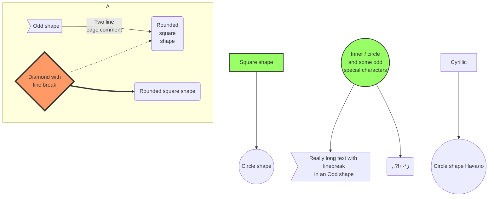

# How schedules work

## The idea
A guide can have a schedule and a scheduled availability. On the scheduling page, there will be a list of dates and time slots to book. Depending on the duration of a given tour, this will remove time slots that aren't availble in a given availability.

